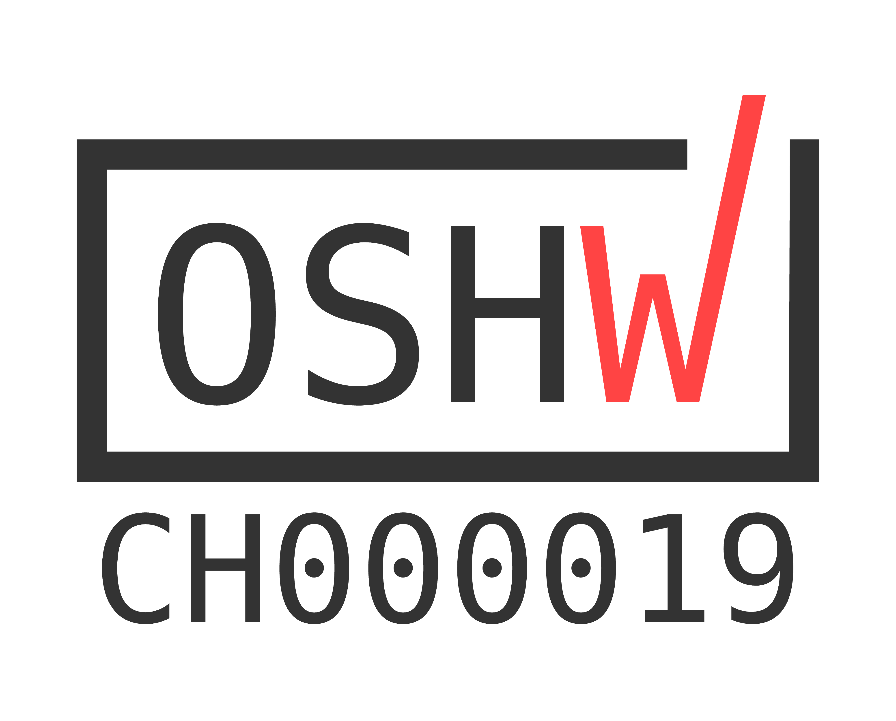

# An addressable RGB LED ring around foot button

| Open Source Hardware | OSHWA Certification|
|---|---|
|  |  |

Features:

- Each of the 12 LEDs on the ring can get an individual color.
- The led rings can be cascaded and addressed via a single serial line.
- Multiple connector options: 2 x SMD Sockets (2mm, 4 Pins) in the center line and in the corner
- Optional solution to drive the LED ring directly from 3.3V data pin, however the 1st LED have a bit lower intensity.

See a [live demo](https://www.youtube.com/watch?v=p5gpGeihErE) where the LED ring is used to represent the LUVS loudness value of signal.

| Top View | Bottom View  |
| -------- | ------------ |
|  |   |
|  |  |

## Generated Hardware Documentation

Downloadable [Assets](https://pedalboard.github.io/pedalboard-led-ring-site) are generated with [KiBot](https://github.com/INTI-CMNB/KiBot)

## Fabrication

* [Generated iBOM](https://pedalboard.github.io/pedalboard-led-ring-site/Assembly/pedalboard-led-ring-ibom.html)
* [Digi-Key shared list](https://www.digikey.ch/de/mylists/list/I3LZUQ0FSV)
* [PCBWay manifacturing](https://www.pcbway.com/project/shareproject/FIXME.html)

## Additional mechanical components

* Foot switch actuator: [Data Sheet](https://www.cliffuk.co.uk/products/switches/FC7125.pdf) [3D Model](https://github.com/pedalboard/pedalboard-case/blob/main/generated/actuator.stl)
* Lens: [3D Model](https://github.com/pedalboard/pedalboard-case/blob/main/generated/led-ring-washer.stl) Potential [material](https://plastics-rubber.basf.com/global/de/performance_polymers/products/ultramid.html)

## Release

The release procedure is not yet fully automated. Please follow below steps:

1. Bump Version
  - In Schematic Editor: File -> Page Settings -> Update Issue Date and Revision (with export to other sheets)
  - In PCB Editor: File -> Page Settings -> Update Issue Date and Revision
  - Update CHANGES.md (release date)
  - Update README.md
     - link the versioned docs.
     - link to a (optinally new) Digikey revision

2. Create a Tag and push it.

3. Create a release.
  - Generate Release Notes
  - Add the relevant content from CHANGES.md
  - Download the generated_output.zip file from the tagged Action run
  - Add the version to generated_output-x.y.z.zip
  - Upload the zip as artifact of the release

4. Tag the pedalboard-hw-site commit of the tagged Action run.
  - Add a link to the tag on pedalboard-hw-site also in the release description
  - copy the tagged files into a subdirectory

5. Bump the version on main to RC1 (as described above)
  - Change old version for diff on pedalboard-hw.kibot.yaml (2 lines!)
  - Add a new Release in CHANGES.md

